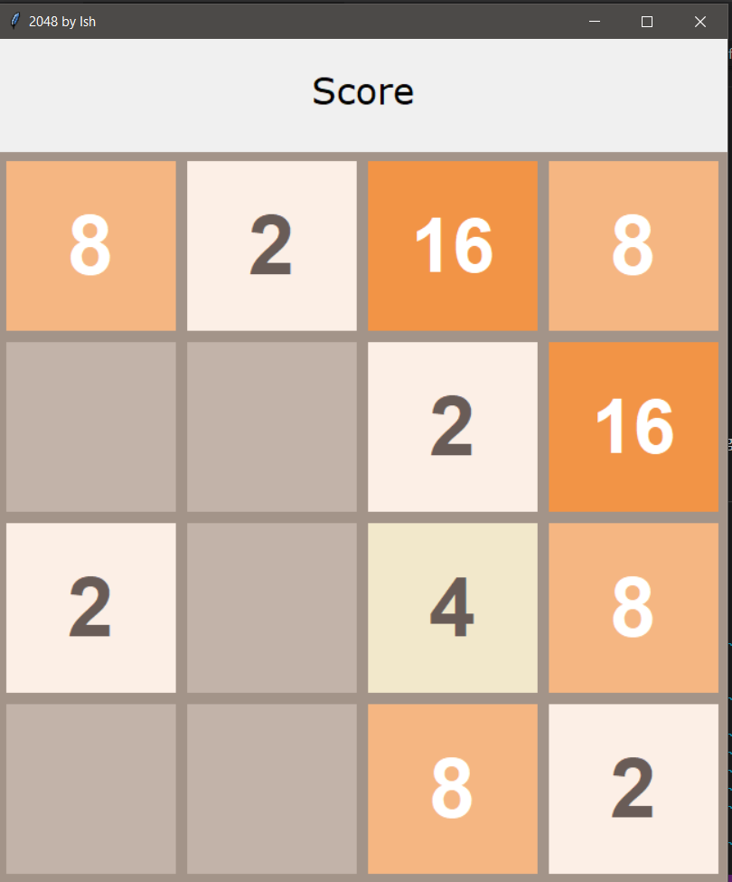

# 2048 Game

# Your_Details
  _Name_: **Ish Kapoor**  
  _GitHubID_: **ishkapoor2000**  
  _YourTopic/Project_: **2048 Game**  
  _Language/Framework_: **Python, Tkinter**  

**_Note_**: Replace <Your Name> with your own full name; replace <Your GitHub ID> with your GitHub ID; replace <Your GitHub ID> with your GitHub ID; replace others likewise. Do not remove ** & **. Make sure to remove <>.

# Explanation_of_Code
I have created a Python version clone of [**2048 Game**](https://2048game.com/). I have used [**Tkinter**](https://wiki.python.org/moin/TkInter) module, to create standard GUI (Graphical User Interface) to play game in executable mode. It uses stacks and qeues concpet to store and add numbers in the grid. It also randomly adds numbers for the user on every move. Arrows keys (Up, Down, Left, Right) are used to move blocks in 2048 Game Window.
The file [colors.py](colors.py) stores all the colors and fonts used in main 2048 GUI.

# Problem_it_Solves [Optional]
An executable version of 2048 game that you can play in your local machine and is also sharable with others.

# Snippet_of_Output

**_Note_**: Delete the optional Heading if not applicable. Add other headings with hierarchical order wherever needed.

